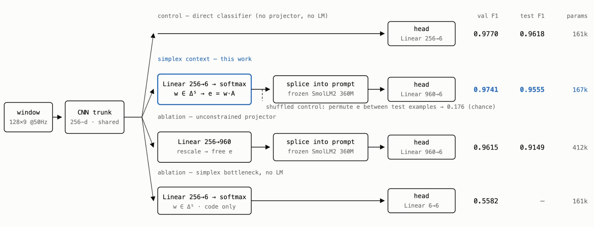

# Sensor Context Encoder Challenge

Can a window of inertial-sensor data be handed to a **frozen language model as one
continuous embedding** — never rendered as text — and read back out as an activity
label? This repository trains the required pair of models on UCI HAR and runs the
sensor-dependence check:

```
direct :  128×9 window → CNN encoder → linear head                                   (baseline)
context:  128×9 window → CNN encoder → projector → e  →  frozen SmolLM2-360M-Instruct → linear head
shuffled: the trained context model, with e permuted across test examples (no retraining)
```

The projector is a **simplex**: `e = softmax(z) · A`, a convex combination of six
frozen token embeddings of SmolLM2's own vocabulary (*walking · climb · descending ·
seated · upright · lying*, chosen to be near-orthogonal synonyms of the six
activities). `e` replaces `<SENSOR>` inside the mandated prompt's input-embedding
sequence; a trainable `Linear(960→6)` reads the final hidden state after `Activity:`.
The LM is frozen end to end, embedding table included. Full writeup with the
interactive figures: <https://czhs.github.io/HCL-ML/>.

## Results (test macro-F1, official subject-wise test split, 9 unseen subjects)

| Condition | seed 0 | mean ± std, 8 training seeds | trainable params |
|---|---:|---:|---:|
| Direct sensor classifier | **0.9618** | **0.9402 ± 0.0154** | 161,286 |
| Context-embedding model (simplex → frozen LM) | **0.9555** | **0.8937 ± 0.1325**¹ | 167,052 |
| — same, 7/8 converged seeds | | 0.9403 ± 0.0159 | |
| Context model with shuffled embeddings | **0.1763** | **0.1652 ± 0.0083** | — |
| *supplementary:* unconstrained 960-d projector | 0.9149 | 0.9138 ± 0.0121 | 412,230 |
| *supplementary:* simplex code without the LM | 0.5375 | 0.6313 ± 0.1146 | 161,328 |

Seeds: split 42 · training 0–7 · shuffle 123 (+ seed for the multi-seed table).
Chance for six balanced classes ≈ 0.167. ¹ One of eight simplex seeds (seed 4)
collapsed to val 0.59 — obvious on validation, so a val gate catches it; the
seven converged seeds are statistically identical to the direct classifier.
Every number above is in [`reference/`](reference/README.md); `python -m hcl.report --results reference`
regenerates the tables (including all ablations) from those JSON files.

## Quick start

Tested on Linux, Python 3.10, one NVIDIA GPU (RTX 4090 / 3060; the frozen LM
needs ≈ 2 GB in bf16). The full seed-0 reproduction takes **~5 minutes** on a 4090.

```bash
git clone https://github.com/czhs/HCL-ML && cd HCL-ML
bash setup.sh        # .venv + deps, downloads UCI HAR (60 MB) and SmolLM2-360M-Instruct (720 MB), sanity check
bash reproduce.sh    # splits → anchor check → train direct/simplex(/free/bottleneck) → test eval → results table
```

`setup.sh` honours `TORCH_SPEC` / `TORCH_INDEX` for a specific CUDA build (the
reference machine's driver 535 needed `TORCH_SPEC=torch==2.5.1 TORCH_INDEX=https://download.pytorch.org/whl/cu121`),
and `HCL_DATA` / `HCL_LM` / `HCL_RESULTS` to relocate the dataset, LM and outputs
(see [`hcl/paths.py`](hcl/paths.py)). `reproduce.sh` writes `results/<run>/` per
run, `results/test_results.json`, `results/figures/` and `results/RESULTS.md`.

**Check the headline numbers without training** — evaluating the shipped
checkpoints is deterministic and must reproduce `reference/test_results.json` exactly:

```bash
source .venv/bin/activate && python -m hcl.make_splits
python -m hcl.eval_test --results reference/checkpoints --variants direct simplex free bottleneck --out results/reference_eval.json
```

## What the pipeline does

| step | command | notes |
|---|---|---|
| splits | `python -m hcl.make_splits` | official subject-wise train/test kept; **val = 4 of the 21 training subjects** (17, 25, 26, 30; seed 42) → 5,800 / 1,552 / 2,947 windows. Test is never used for selection. |
| anchors | `python -m hcl.label_tokens [--check]` | synonym islands in SmolLM2's (centred) embedding space → three profiles in [`configs/label_tokens.json`](configs/label_tokens.json): `canonical` (nearest synonym per island), **`balanced`** (most separated sextet keeping Σ synonym-similarity ≥ 4.10 — the model uses this), `orthogonal` (most separated, meaning allowed to weaken). `--check` verifies the committed file regenerates token-for-token. |
| train | `python -m hcl.train --variant {direct,simplex,free,bottleneck} --seed S` | AdamW 1e-3, cosine, wd 1e-4, batch 128, 30 epochs, CE loss, per-channel z-scoring from train statistics; best-val checkpoint kept. Deterministic cuDNN by default. |
| test | `python -m hcl.eval_test --seed S` | one pass per condition; the shuffled check permutes the *complete* projected embeddings between test examples (`--shuffle-seed 123`) and re-runs the frozen LM + head. |
| report | `python -m hcl.report` / `python -m hcl.plots` | Markdown tables; confusion matrices, validation curves, K-sweep. |
| multi-seed | `bash scripts/run_seeds.sh` | 8 seeds × 4 variants → `python -m hcl.eval_seeds` (≈ 40 min). |
| ablations | `bash scripts/run_ablations.sh` | everything below (≈ 1.5 h). |

**Reproduction log.** 2026-08-21, fresh clone on the reference machine (RTX 4090,
`TORCH_SPEC=torch==2.5.1 TORCH_INDEX=…/cu121`): `setup.sh` + `reproduce.sh` retrained
all four seed-0 models and reproduced every reference number **exactly** (per-epoch
validation curves included), and `eval_test` on the shipped checkpoints matched
`reference/test_results.json` to four decimals. On other GPUs / CUDA builds expect
agreement within the seed-to-seed spread above (≈ 0.015 F1 on test), not bit-for-bit.

## Design in one paragraph

**Encoder** (shared by every condition): three `Conv1d` stages 9→64 (k5,s2), 64→128
(k5,s2), 128→128 (k3), each BatchNorm + GELU, global mean‖max pooling over time, `Linear(256→256)`+GELU — 160,742 parameters.
**Projector**: `Linear(256→6)` → softmax → barycentric weights `w` on the 5-simplex → `e = w·A`,
with `A` the six frozen anchor rows of the LM's embedding table (max pairwise cosine 0.24,
vs 0.82 for the raw label phrases, which share the token ` walking`). `e` is guaranteed to lie
on the LM's input manifold and the encoder's whole interface to the LM is six numbers.
**Head**: `Linear(960→6)` on the last hidden state. The direct classifier is the same
trunk with `Linear(256→6)`, so the comparison isolates the interface.



## Ablations (validation macro-F1; all reproducible with `scripts/run_ablations.sh`)

| question | run tag | result |
|---|---|---|
| Do anchor *semantics* matter? six maximally separated meaning-free tokens (*the · antioxid · agitated · salaries · whe · toggle*) | `simplex-geometric` | 0.9696 ± 0.0038 (3 seeds) — ties the synonym anchors (0.9673 ± 0.0101 over converged seeds) |
| Learnable corners (token init) | `simplex-learnA` | 0.9675 ± 0.0040 — ties; corners barely move, hull contracts |
| Learnable corners, random off-manifold init | `simplex-learnA-randinit` | 0.9536 ± 0.0194 — 1/3 seeds fully healthy; never migrates toward the token cloud |
| Does the *pretrained* transformer matter? random frozen transformer, pretrained embeddings kept | `simplex-randLM` | **0.6172 ± 0.0252** — pretraining is worth ~35 points |
| Does the prompt matter? no prompt text at all | `simplex-noprompt` | 0.9779 / 0.5804 / 0.9672 — ties when it converges (1/3 collapse) |
| Does prompt *content* matter? unrelated recipe prompt | `simplex-unrelatedprompt` | 0.9609 ± 0.0142 — ties |
| How many corners? frozen max-separated tokens, K = 1…64 | `simplex-geometric{K}` | 0.05 / 0.69 / 0.96 / 0.97 / 0.97 / 0.95 / 0.98 / 0.97 / 0.95 for K = 1/2/4/6/8/12/16/32/64 — plateau from K ≈ 4 |
| One scalar through the LM: K = 1 with a sigmoid gate (magnitude code) | `simplex-geometric1-gate` | **0.9361** |
| Same 6-number bottleneck, LM removed | `bottleneck` | 0.6610 ± 0.1221 (8 seeds) — the frozen LM is load-bearing |
| Where does the LM use the code? layer-wise probes, attention, logit lens | `python -m hcl.mech_probe --run simplex_s1` | activity decodable at the readout position right after layer 1 (0.97) and flat for 31 more layers; vocabulary space ignores the sensor until the last ~4 layers |
| Is `w` a classification? PCA / smoothness / subject probe | `python -m hcl.analyze_continuity` | argmax(w) = label only 31%; ~4 of 5 DOF used; adjacent windows 3.3× closer than random same-class pairs |

(Learnable-corner K-sweep, run on a cloud box, checkpoints not retained: 0.05 / 0.94 / 0.98 / 0.95 / 0.97 / 0.95 / 0.96 / 0.96 / 0.95 for K = 1/2/4/6/8/12/16/32/64.)

## Layout

```
setup.sh, reproduce.sh        entry points (see above)
requirements*.txt             pinned, tested versions
hcl/                          the package — run modules with `python -m hcl.<name>`
  paths.py                    all locations; env-overridable
  make_splits.py              subject-wise splits (seed 42)
  label_tokens.py             anchor-token search (canonical / balanced / orthogonal profiles)
  geometric_anchors.py        meaning-free max-separated anchors + K ladders
  model.py                    encoder, direct / simplex / free / bottleneck models, checkpoint I/O
  train.py  eval_test.py  eval_seeds.py  report.py  plots.py  collect_runs.py
  mech_probe.py  analyze_continuity.py  umap_simplex.py      analyses
configs/label_tokens.json     the anchor profiles the models read
scripts/run_seeds.sh          8-seed protocol;  scripts/run_ablations.sh  every ablation
reference/                    the numbers in the note + seed-0 checkpoints (see reference/README.md)
figures/                      figures used in the note / writeup
TECHNICAL_NOTE.md             the two-page technical note (PDF: docs/TECHNICAL_NOTE.pdf, built by docs/build_note.py)
```

## Notes

- Prompt (verbatim from the challenge): `Classify the activity as walking, walking upstairs, walking downstairs, sitting, standing, or laying.\n\nSensor context: <SENSOR>\nActivity:` — `<SENSOR>` is the single embedding slot (position 28 of 32).
- Only the nine `Inertial Signals` channels are used; the 561-d engineered features are never read.
- Checkpoints store the trainable parts and the prompt/anchor buffers only (≈ 0.7 MB); the LM is reloaded from the hub.
- The writeup's data-exploration tooling (3-D dead-reckoning viewers, live playground) is not part of this repository.
